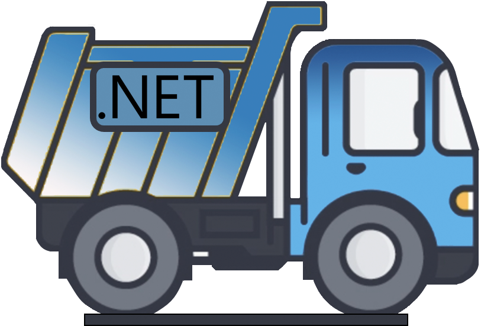

# DotDumperNative
This module is a C++ based library, which is to be used in combination with [DotDumper](https://github.com/advanced-threat-research/DotDumper). The methods within this library should be hooks for unmanaged (or native, if you wilL) functions, which DotDumper hooks and redirects towards this function. Be careful when calling functions within the given hook, as those may be hook already and thus cause a recursive loop. Unhooking one or more functions is possible from within the hook, via the named pipe communication with DotDumper itself. Compilation should be done for both x86 and x64 architectures, after which the library files should be placed in DotDumper's main folder, named "DotDumperNative_x86.dll" and "DotDumperNative_x64.dll" respectively. 

This library is loaded dynamically, meaning it can be updated when DotDumper is not running. Depending on the change, DotDumper itself might require changes.
